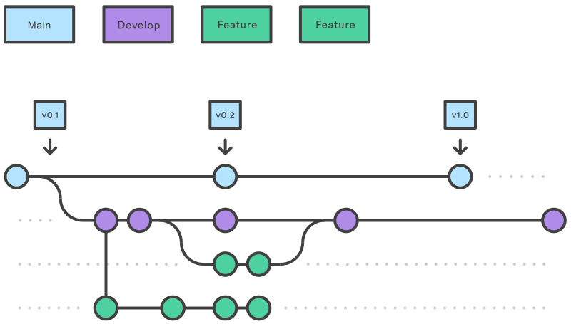

# Processo di sviluppo adottato
Per lo sviluppo del progetto è stato adottato un processo ispirato alle tecniche agili proposte da Scrum: i membri del team hanno avuto modo di avvicendarsi nei seguenti ruoli:
- Product Owner: il product owner è la figura che lavora più a stretto contatto col customer in quanto si occupa di individuare gli obiettivi da raggiungere per apportare valore al customer e di stilare la lista di feature da sviluppare;
- Scrum Master: il compito dello scrum master è quello di guidare il team circa l'adozione del paradigma scrum;
- Team di sviluppo

## Produzione dei requirement
La prima attività intrapresa dal team è stata quella di analisi dei requisiti del sistema, durante la quale è stato prodotto un `documento dei requirements` che abbracciavano caratteristiche del sistema sia funzionali che non, con particolare attenzione anche ai requisiti user-centric, che apportano valore all'utente e alla sua esperienza di uso del software.

## Product Backlog
A fronte di tale analisi è stato stilato un `product backlog`, contenente una serie di elementi che rappresentano le feature user centric da sviluppare, mantenuta in ordine di priorità dal Product Owner, affiancati da una stima di effort da spendere per completare la feature.

## Sprint
Lo sviluppo di tali funzionalità si è articolato secondo unità di tempo, chiamate Sprint, che scandivano il ritmo con il quale venivano effettuate riunioni e confronti tra gli sviluppatori. Al termine di una sprint settimanale, il team si riuniva per effettuare una retrospettiva su quanto svolto durante la sprint precedente, evidenziando ciò che è stato svolto, ciò che restava da sviluppare ed eventuali difficoltà incontrate fino a quel momento. Al termine della retrospettiva, il Product Owner aggiornava il backlog aggiungendo nuovi elementi da sviluppare o modificando l'effort richiesto per il completamento di un dato elemento.

## Workflow
Durante la sprint, per organizzare il lavoro da svolgere, è stato prodotto uno `sprint backlog`: un artefatto che, similmente al product backlog, tiene traccia delle feature da sviluppare, suddividendole però in Task, sottoporzioni indipendenti di lavoro da svolgere per completare l'item.

Per quanto riguarda la definizione dei task è stato utilizzato Trello, in questo modo è stato possibile tener traccia dello stato di avanzamento del progetto.

## Version Control
Il Version Control System scelto per coordinare lo sviluppo in team è Git. Dunque, è stata creata una repository Git su Github organizzata come segue:
- È presente un branch _main_, il quale contiene il codice di produzione del progetto. Ogni release è marcata da uno specifico tag.
- Il branch _develop_ contiene la versione del codice che poi andrà in produzione nel branch _main_. In questo branch vengono introdotte le nuove funzionalità che devono essere testate.
- Per lo sviluppo di ogni funzionalità viene creato un branch apposito, che poi verrà unito al branch _develop_.

## Tool Utilizzati
- Come build tool è stato utilizzato SBT.
- Per la suddivisione dei task è stato utilizzato Trello.
- ScalaTest è stato utilizzato per la scrittura dei test.
- Per la formattazione del codice è stato utilizzato sbt-scalafmt.
- Per la creazione del jar eseguibile è stato utilizzato sbt-assembly.
- Per la code coverage è stato utilizzato sbt-scoverage.
- GitHub è stato utilizzato come servizio di hosting per la repository.
- Le GitHub Actions sono state utilizzate per automatizzare l'esecuzione dei test e della code coverage e per la creazione delle release.
- Codecov è stato utilizzato per analizzare le statistiche della code coverage.