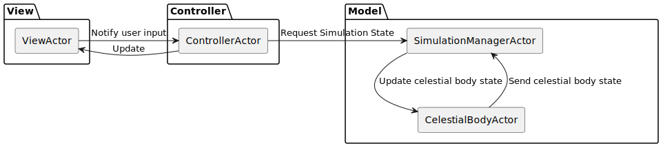

# Design architetturale
Inizialmente si è deciso di utilizzare il pattern architetturale _Model View Controller_,
il quale successivamente è stato rivisto per l'introduzione del paradigma basato su scambio di messaggi,
mantenendo comunque le dipendenze e le interazioni definite dal pattern architetturale originale.

I principali attori che compongono l'architettura sono i seguenti:
- `SimulationManagerActor` e `CelestialBodyActor` gestiscono interamente la parte di _Model_:
  - `SimulationManagerActor` detiene lo stato attuale della simulazione e si occupa di coordinare le istanze di `CelestialBodyActor` durante le iterazioni della simulazione.
  - Ogni `CelestialBodyActor` si occupa dello stato di un corpo celeste.
- `ControllerActor` si occupa di gestire il _Controller_, quindi si frappone fra `SimulationManagerActor` e `ViewActor`:
  - `ControllerActor` invia periodicamente aggiornamenti alla _View_ sulla base dello stato corrente della simulazione.
- `ViewActor` gestisce la _View_ e notifica gli input dell'utente al `ControllerActor`.
