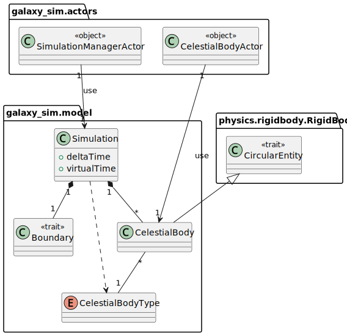

# Design di dettaglio

## Model

### Simulazione

La simulazione è definita nel seguente modo è una composizione di:
- Un insieme di corpi celesti, distinti tra loro, dei quali viene definito il tipo.
- Dei confini, i quali stabiliscono i confini dello spazio toroidale nel quale i corpi celesti si possono muovere.

Inoltre la simulazione detiene il tempo virtuale e il suo delta, utilizzato per incrementarlo.
Un corpo celeste, dal punto di vista geometrico, viene considerato come circolare,
questo per fare in modo che le collisioni vengano rilevate correttamente.
A ogni corpo celeste corrisponde uno e un solo tipo (es: pianeta) e allo stesso tempo più
corpi celesti possono essere dello stesso tipo.

Di seguito il diagramma delle classi che riguardano la simulazione:



### Lifecycle
Il tipo di CelestialBody è dato dalla sua _massa_ e dalla sua _temperatura_. Le regole per classificare il CelestialBody in _massive star, red super giant, supernova, black hole, planet, asteroid_ o _interstellar cloud_ sono contenute nel file prolog.

La classe `EntityIdentifier` permette di interfacciarsi con prolog e controllare quindi il tipo di CelestialBody.

La classe `Lifecycle` fornisce il metodo `entityOneStep`, il quale si occupa di apportare delle modifiche alle proprietà di un dato CelestialBody. Le modifiche variano in base al tipo di CelestialBody, come riportato nella seguente tabella:
<table>
<tr><th>Tipo</th><th>Modifica apportata</th></tr>
<tr><td>Planet</td><td>Nessuna modifica</td></tr>
<tr><td>Asteroid</td><td>Riduzione massa dell'1%</td></tr>
<tr><td>Interstellar Cloud</td><td>Aumento massa e temperatura dell'1%</td></tr>
<tr><td>Massive Star</td><td>Aumento o riduzione massa di un valore prefissato</td></tr>
<tr><td>Red Super Giant</td><td>Aumento o riduzione massa di un valore prefissato</td></tr>
<tr><td>Supernova</td><td>Aumento o riduzione massa di un valore prefissato</td></tr>
<tr><td>Black Hole</td><td>Aumento o riduzione massa di un valore prefissato</td></tr>
</table>
<!---->

## View

## Controller

## Attori

Sono presenti quattro tipi di attori, che comunicano tra loro tramite scambio di messaggi.
Ogni attore ha uno scopo specifico e dispone di un set di comandi che gli possono essere impartiti.
La tabella seguente contiene i comandi degli attori:

<table>
<tr><th>Attore</th><th>Comando</th><th>Descrizione</th></tr>
<tr><td>ViewActor</td><td>Display</td><td>Aggiorna la View, viene inviato dal ControllerActor</td></tr>
<tr><td>ViewActor</td><td>StartPressed</td><td>Viene inviato dalla View nel momento in cui il pulsante "Start" viene premuto</td></tr>
<tr><td>ViewActor</td><td>StopPressed</td><td>Viene inviato dalla View nel momento in cui il pulsante "Stop" viene premuto</td></tr>
<tr><td>ControllerActor</td><td>Start</td><td>Avvia la simulazione</td></tr>
<tr><td>ControllerActor</td><td>Stop</td><td>Ferma la simulazione</td></tr>
<tr><td>ControllerActor</td><td>SetView</td><td>Imposta il ViewActor che gestisce l'interfaccia grafica</td></tr>
<tr><td>ControllerActor</td><td>SimulationStateAdaptedResponse</td><td>Utilizzato come Adapter per il pattern Ask</td></tr>
<tr><td>ControllerActor</td><td>Tick</td><td>Inviato dal timer per richiedere lo stato della simulazione e aggiornare la View</td></tr>
<tr><td>SimulationManagerActor</td><td>StartSimulation</td><td>Avvia la simulazione</td></tr>
<tr><td>SimulationManagerActor</td><td>StopSimulation</td><td>Ferma la simulazione</td></tr>
<tr><td>SimulationManagerActor</td><td>IterationStep</td><td>Esegue uno step all'interno dell'iterazioni corrente</td></tr>
<tr><td>SimulationManagerActor</td><td>CelestialBodyState</td><td>Inviato da CelestialBodyActor per notificare lo stato di un corpo celeste</td></tr>
<tr><td>SimulationManagerActor</td><td>AskSimulationState</td><td>Utilizzato dal ControllerActor per richiedere lo stato della simulazione, fa parte del pattern Ask</td></tr>
<tr><td>SimulationManagerActor</td><td>SimulationStateResponse</td><td>Riposta dei AskSimulationState, non viene inviata a SimulationManagerActor</td></tr>
<tr><td>CelestialBodyActor</td><td>GetCelestialBodyState</td><td>Richiede lo stato del corpo celeste</td></tr>
<tr><td>CelestialBodyActor</td><td>UpdateCelestialBodyType</td><td>Aggiorna lo stato del corpo celeste</td></tr>
<tr><td>CelestialBodyActor</td><td>MoveToNextPosition</td><td>Sposta il corpo celeste</td></tr>
<tr><td>CelestialBodyActor</td><td>SolveCollisions</td><td>Risolve le collisioni con gli altri corpi celesti</td></tr>
<tr><td>CelestialBodyActor</td><td>Kill</td><td>Termina l'attore</td></tr>
</table>

Di seguito il diagramma delle classi degli attori:


## Physics
Il componente `physics` del sistema si occupa di definire i concetti riguardanti l'universo fisico ed i calcoli annessi. Nello specifico, si possono suddividere le responsabilità del modulo `physics` in due macro aspetti:
- Gestione delle collisioni: implementata nel package `physics.collisions`.
- Gestione della dinamica: implementata nel package `physics.dynamics`

### Collisions
L'obiettivo di questo modulo è fornire una API per definire come rilevare collisioni tra due oggetti, implementata nel package `collisions.intersection` e specificare la reazione all'impatto avvenuto, realizzata nel package `collisions.impact`. Questi due concetti offrono una loro API indipendente compresa di moduli di funzioni utili, come `Intersection` e `Impact`, e sintassi ad-hoc. A questi sotto-moduli si unisce un modulo `CollisionEngine` che riunisce le due API per implementare le collisioni in maniera più sintetica.

### Dynamics
Lo scopo di questo modulo è fornire una API per il calcolo di formule gravitazionali, esse sono applicabili in uno spazio bi-dimensionale rappresentante l'universo.
Vengono offerte dunque due API: `PhysicsFormulas` indipendente e `GravitationLaws` dipendente dalla precedente. La prima offre i calcoli individuali dai quali si possono ricavare alcune formule gravitazionali, mentre la seconda utilizza le formule della prima per l'implementazione vera e propria delle nozioni di astrofisica.


## Pattern utilizzati
### Strategy
Il pattern Strategy consiste nell'isolare un algoritmo o una strategia al di fuori di una classe, per fare in modo che quest'ultima possa variare dinamicamente il suo comportamento. In Scala è applicato in maniera semplice ed efficace con l'uso delle high order functions, un esempio è il seguente: 
```scala
def updateMass(f: Mass => Mass): CelestialBody = 
    celestialBody.copy(mass = f(celestialBody.mass))
```
`updateMass` è una funzione alla quale viene iniettata la strategia da utilizzare per modificare la massa.
### Factory
Il pattern Factory è un design pattern che consiste nel separare le logiche di creazione di un oggetto o dato dalla sua definizione. In scala, questo design pattern è facilmente
implementabile attraverso l'uso del Companion Object: un particolare oggetto singleton che può fungere da contenitore di varie funzioni riguardanti un certo tipo di dato, tra cui
anche funzioni di creazione (un caso notevole di questo è il metodo "apply"). All'interno del progetto possiamo trovare anche funzioni di factory diverse da apply, come nel caso della
libreria "collisions":
```scala
/** Constructs an [[Impact]] starting from a function of the type (A, A) => A. */
def from[A](f: (A, A) => A): Impact[A] = (a1: A, a2: A) => f(a1, a2)
```
Questa funzione di factory, per quanto semplice, permette di realizzare implementazioni della type class Impact in maniera più snella rispetto alla semplice implementazione per estensione,
più propria della object orientation.

### Singleton
Il pattern singleton consiste nel restringere l'istanziazione di una casse ad un solo elemento. Questo pattern si rivela particolarmente utile quando è necessario un solo oggetto a coordinare determinate operazioni all' interno del sistema e si vuole accedere staticamente ad esso, senza passaggio di riferimenti sparso lungo il codice. Scala permette allo sviluppatore di adottare questo pattern a livello di linguaggio con l'introduzione del costrutto `object`. All'interno del progetto possiamo trovare un esempio di Singleton pattern impiegato come libreria o contenitore di funzioni:
```scala
object CollisionEngine:
  def collides[A](a1: A, a2: A)(using Intersection[A]): Boolean
  ...
```

### Facade
Il Facade pattern consiste nel fornire un'interfaccia semplice per nascondere alcuni blocchi di codice più complessi.
In questo progetto il pattern Facade è stato utilizzato per fornire la seguente interfaccia, la quale semplifica l'utilizzo del grafico a torta della libreria _JFreeChart_:
```scala
trait PieChart:
  def wrapToPanel: ChartPanel
  def title: String
  def setValue(key: String, value: Double): Unit
  def clearAllValues(): Unit
```

### Pimp my library
È un pattern di programmazione funzionale che si basa sul concetto di estensione delle funzionalità di un tipo di dato senza modificarlo. L'approccio tipico della FP è quello di definire
i dati e le funzioni in sorgenti separati, ed eventualmente legarli insieme successivamente attraverso il pimping delle funzioni sui dati. In scala, il meccanismo `extension`
permette di effettuare il pimping di un tipo di dato senza modificarlo. Un esempio di utilizzo di questo pattern all'interno del progetto si può trovare nel file `CollisionSyntax`:
```scala
 extension [A](a: A)
    @targetName("collidesWith")
    def |#|(other: A)(using Intersection[A]): Boolean =
      collides(a, other)

    @targetName("impactWith")
    def |*|(other: A)(using Intersection[A])(using Impact[A]): A =
      impact(a, other)
```
Con l'uso del meccanismo delle estensioni, si aggiungono ad un tipo generico A dei metodi che sfruttano le API di collisione.
Un altro esempio di uso del pattern è il seguente:
```scala
object OperationsOnCelestialBody:
    extension (celestialBody: CelestialBody)
        def updateMass(f: Mass => Mass): CelestialBody = 
            celestialBody.copy(mass = f(celestialBody.mass))
        def updateTemperature(f: Temperature => Temperature): CelestialBody = 
            celestialBody.copy(temperature = f(celestialBody.temperature))
```
In questo caso è stato creato un oggetto `OperationsOnCelestialBody` il quale, se importato nella classe desiderata, permette di utilizzare i metodi `updateMass` e `updateTemperature` come se fossero dei metodi definiti nella classe `CelestialBody`.

### Adapter
Il pattern Adapter è facilmente implementabile in Scala attraverso il meccanismo delle _given conversion_. In questo progetto sono state utilizzate nella classe `Scala2P` per migliorare l'integrazione con Prolog, come riportato di seguito:
```scala
given Conversion[String, Term] = Term.createTerm(_)
given Conversion[String, Theory] = Theory.parseLazilyWithStandardOperators(_)
given Conversion[Term, CelestialBodyType] = _.toString match
  case "massiveStar" => MassiveStar
  case "redSuperGiant" => RedSuperGiant
  case "supernova" => Supernova
  case "blackHole" => BlackHole
  case "planet" => Planet
  case "asteroid" => Asteroid
  case "interstellarCloud" => InterstellarCloud
```

### Type classes
La Type Class è una tipologia di classe astratta e parametrizzata sul tipo, che permette di aggiungere un dato comportamento ad un qualunque tipo di dato senza utilizzare
ereditarietà. In scala, si definiscono type classes in questo modo: Combiner[A], dove il tipo A racchiuso tra quadre rappresenta un qualunque tipo chiuso. All'interno del progetto, possiamo trovare
esempi di type class nel package `physics.collisions`, in cui troviamo le type classes `Intersection`, `Impact` e `Collider`

## Struttura dei package
Il codice è stato strutturato in package come descritto nel diagramma seguente:
