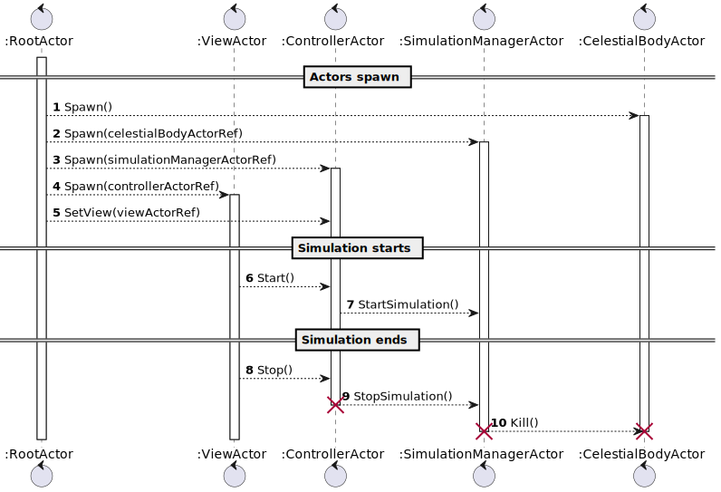
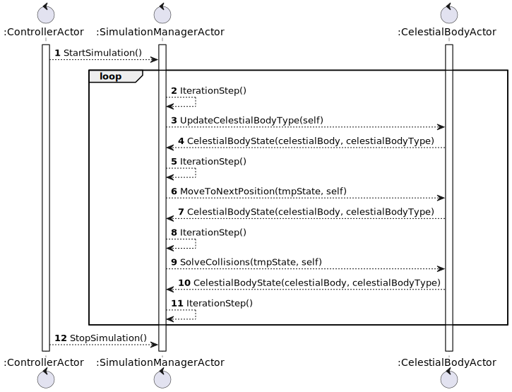
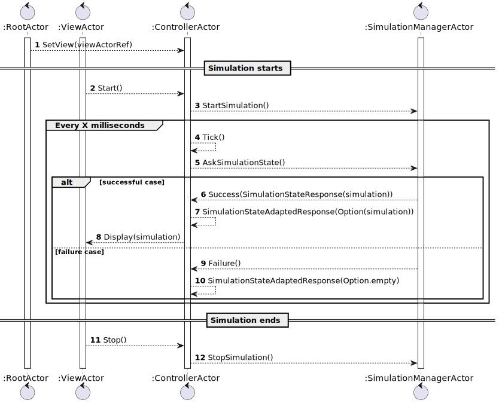

# Implementazione

## Programmazione funzionale
### Recursion
Il concetto di ricorsione si riferisce ad un metodo di risoluzione di un problema computazionale, a partire dalle soluzioni di istanze più piccole dello stesso problema. Nella programmazione funzionale si realizza questo pattern risolutivo attraverso la definizione di funzioni che si richiamano da sole nel proprio codice, come nel seguente esempio:
```scala
  @tailrec
  def impactMany[A](a: A, others: Seq[A])(using Intersection[A])(using Impact[A]): A =
    others match
      case h +: t => val a1 = impact(a, h) ; impactMany(a1, t)
      case Seq() => a
```
In questo caso la ricorsione è tail, poichè l'ultima istruzione della funzione è una chiamata ricorsiva alla funzione stessa, senza mettere in pila ulteriori operazioni "deferred". Questo tipo di ricorsione è particolarmente utile nell'algoritmica in quanto facilmente ottimizzabile tramite loop. In scala, possiamo forzare l'ottimizzazione di una funzione tail recursive tramite l'annotazionwe @tailrec.

### For comprehension
### Higher-order functions
 Una Higher order function è una funzione che prende in input funzioni come parametri e/o restituisce funzioni come risultato. L'utilizzo di questo meccanismo nella programmazione funzionale permette di applicare in maniera semplice il _pattern Strategy_, oltre a rendere il codice riusabile.

 Sono state utilizzate in diverse parti del progetto, un esempio di higher order function è il seguente:
 ```scala
def updateTemperature(f: Temperature => Temperature): CelestialBody =
  val normalizer = normalize(minTemp, maxTemp)
  celestialBody.copy(temperature = normalizer(f(celestialBody.temperature)))
 ```
`updateTemperature` è una funzione alla quale viene iniettata la strategia da utilizzare per modificare la temperatura, sotto forma di funzione _f_.

### Pattern matching
È un meccanismo che permette di avere codice conciso e leggibile, ma allo stesso tempo concede la possibilità di fare matching di elementi su pattern complessi, anziché su un solo esatto valore.
È stato utilizzato in varie parti del progetto, un esempio di pattern matching è il seguente:
```scala
def toToroidal(position: Pair): Pair =
    val x = position match
      case Pair(x, _) if x < leftBound => rightBound
      case Pair(x, _) if x > rightBound => leftBound
      case _ => position.x
    [...]
```
Meccanismo utile anche nell'implementazione dello scambio di messaggi ad attori con il framework _akka_, in quanto utilizzato per fare il matching dei messaggi ricevuti dai vari attori.

### Option
La classe `Option` nella programmazione funzionale viene utilizzata nel caso in cui è possibile che un valore sia assente, in tal modo si evita l'utilizzo del valore `null`.
All'interno del progetto è stata utilizzata ad esempio nella classe `EntityReferenceDetector` in quanto necessaria la possibilità di restituire un'entità di riferimento, qualora non fosse l'entità stessa l'oggetto più massiccio della simulazione.
```scala
 override def getReference(entity: CelestialBody, entities: Set[CelestialBody]): Option[CelestialBody] = 
    [...]
    check(list)
    
    @tailrec
    private def check(list: List[(CelestialBody, Double, Double)], ref: Option[(CelestialBody, Double, Double)] = Option.empty): Option[CelestialBody] = ref match
    [...]
```
Si può notarne l'utilizzo anche nella funzione ricorsiva `check()` in quanto prende come parametro un riferimento temporaneo, che può appunto essere assente.

### Type members

### Given conversion
Il meccanismo delle given conversion permette di applicare in maniera semplice e immediata il _pattern adapter_ in Scala. In questo progetto sono state utilizzate nella classe `Scala2P` per migliorare l'integrazione con Prolog, come riportato di seguito:
```scala
given Conversion[String, Term] = Term.createTerm(_)
given Conversion[String, Theory] = Theory.parseLazilyWithStandardOperators(_)
given Conversion[Term, CelestialBodyType] = _.toString match
  case "massiveStar" => MassiveStar
  case "redSuperGiant" => RedSuperGiant
  case "supernova" => Supernova
  case "blackHole" => BlackHole
  case "planet" => Planet
  case "asteroid" => Asteroid
  case "interstellarCloud" => InterstellarCloud
```

### Currying
In scala è possibile sfruttare il meccanismo di currying per convertire una funzione a più argomenti in una sequenza di funzioni che prendono un solo argomento. Ogni funzione ritorna un'altra funzione che consuma l'argomento successivo.

Esempio di funzione curried in questo progetto:
```scala
private def normalize(minBound: Double, maxBound: Double)(value: Double): Double = ...
```

Utilizzo della funzione curried con applicazione parziale:
```scala
def updateMass(f: Mass => Mass): CelestialBody =
  val normalizer = normalize(minMass, maxMass)
  celestialBody.copy(mass = normalizer(f(celestialBody.mass)))
```

Questo meccanismo favorisce il riuso di codice e quindi l'applicazione del principio DRY, in quanto permette di applicare parzialmente la funzione per poi utilizzarla in più punti del codice.

### Contextual programming
Il concetto di `contesto` di una funzione si riferisce a quegli argomenti che vengono usati per influenzare il modo in cui la funzione produce il suo output a partire dagli input. Questa tipologia di modellazione delle funzioni è facilmente implementabile in Scala attraverso il meccanismo delle Given instance: si possono definire dei parametri di contesto di una funzione con la keyword `using`. Quando la funzione verrà invocata, il compilatore si occuperà di cercare nello scope corrente dei parametri di contesto appropriati definiti con la keyword `given`. Se la ricerca ha successo, la funzione utilizzerà tali parametri senza bisogno che vengano specificati come input dall'utente.
Un esempio di funzione che fa uso di given instances è la seguente:
```scala
def collides[A](a1: A, a2: A)(using Intersection[A]): Boolean =
    a1 intersects a2
```
Di seguito un esempio di definizione di parametro di contesto attraverso given instance:
```scala
given CircleToCircleIntersection: Intersection[CircleCollisionBox] =
    Intersection.from((c1, c2) => {
      val dx = c1.origin.x - c2.origin.x
      val dy = c1.origin.y - c2.origin.y
      val dist = Math.sqrt(dx * dx + dy * dy)
      dist < c1.radius + c2.radius
    })
```

Anche la funzione `entityOneStep` della classe `Lifecycle` fa uso di given instances:
```scala
def entityOneStep[A](entity: CelestialBody, bodyType: A)(using lifecycleRules: LifecycleRules[A]): (CelestialBody, A) =
  lifecycleRules.updateMassAndTemperature(entity, bodyType)
```
Come si può vedere dal codice viene infatti richiesto un parametro di contesto, oltre ai parametri di input _entity_ di tipo CelestialBody e _bodyType_ generico. In questo modo si possono definire i parametri di contesto per ogni _bodyType_ attraverso le given instances.

Nel progetto è presente una sola given instance in quanto il _bodyType_ corrisponde all'enum `CelestialBodyType`. Avendo però prodotto questa implementazione è facile e immediato aggiungere delle given instances nel caso in cui si voglia estendere il sistema, inserendo ad esempio delle case class invece dell'enum per indicare i _bodyType_.
```scala
given LifecycleRules[CelestialBodyType] with
  override def updateMassAndTemperature(celestialBody: CelestialBody, bType: CelestialBodyType): (CelestialBody, CelestialBodyType) = ...
```

## Programmazione logica
Il paradigma di programmazione logico è stato utilizzato in questo progetto per identificare i diversi tipi di entità, in base alla massa e alla temperatura.

I termini prolog utilizzati per identificare le entità sono contenuti nel file `EntityIdentifier.pl`. Secondo la logica riportata di seguito le entità vengono classificate in _Interstellar Cloud, Asteroid, Planet_ e _Star_.
```prolog
typeOfEntity(Temp, Mass, X) :- 1000 < Temp, typeOfStar(Mass, X), !.
typeOfEntity(Temp, _, interstellarCloud) :- 100 < Temp, !.
typeOfEntity(Temp, _, planet) :- 50 < Temp, !.
typeOfEntity(Temp, _, asteroid).
```
A loro volta le Star vengono identificate in _BlackHole, Supernova, Red Super Giant_ e _Massive Star_ in base alla loro massa.
```prolog
minMass(10**40, blackHole).
minMass(10**20, supernova).
minMass(10**10, redSuperGiant).
minMass(0, massiveStar).
typeOfStar(Mass, Star) :- minMass(MinMass, Star), Mass > MinMass.
```

La classe `Scala2P` si occupa di creare l'engine prolog e fornire una funzione per risolvere un goal.
Per controllare il tipo di entità viene utilizzata la classe `EntityIdentifier`.
```scala
def checkEntityType(mass: Mass, temperature: Temperature): CelestialBodyType = 
    val goal = s"typeOfEntity($temperature, $mass, E)"
    solveOneAndGetTerm(engine, goal, "E") 
```

# Programmazione basata su scambio di messaggi

Il paradigma di programmazione basato su scambio di messaggi è stato introdotto facendo uso della libreria Akka.

Di seguito vengono riportati i diagrammi di sequenza che definiscono le interazioni tra gli attori
che sono già stati descritti nei capitoli precedenti.

Ciclo di vita degli attori:



Sequenza di messaggi che vengono scambiati all'interno di un'iterazione della simulazione:



Sequenza dei messaggi utilizzati per aggiornare la _View_:



## Sezioni personali

### Barzi Eddie
Inizialmente mi sono occupato di gestire il ciclo di vita delle entità, sfruttando Prolog per l'identificazione delle stesse. Le classi relative a questo lavoro sono le seguenti:
- `Scala2P`
- `EntityIdentifier`
- `Lifecycle`
- `OperationsOnCelestialBody`

Successivamente sono passato allo sviluppo delle classi per calcolare e visualizzare le statistiche della simulazione:
- `Statistics`
- `PieChart`

Infine ho provveduto ad integrare le statistiche della simulazione nella schermata principale: 
- `StatisticsPanel`
- `SimulationGUI`

La seguente tabella riporta i meccanismi avanzati e/o i pattern utilizzati nelle classi indicate:

<table>
<tr><th>Classe</th><th>Meccanismi o pattern utilizzati</th></tr>
<tr><td>Scala2P</td><td>- Implicit conversions</td></tr>
<tr><td>EntityIdentifier</td><td>- Singleton</td></tr>
<tr><td>Lifecycle</td><td>- Contextual programming <br /> - Type classes <br /> - Pattern matching <br /> - Infix extension method</td></tr>
<tr><td>OperationsOnCelestialBody</td><td>- Extension method <br /> - Higher-order functions <br /> - Curried function</td></tr>
<tr><td>Statistics</td><td>- Type alias <br /> - Higher-order functions</td></tr>
<tr><td>PieChart</td><td>- Facade <br /> - Factory</td></tr>
<tr><td>StatisticsPanel</td><td>- Tail recursive function</td></tr>
<tr><td>SimulationGUI</td><td>/</td></tr>
</table>

### Cortecchia Angela
Il mio scopo principale è stato quello di creare una libreria di calcoli fisici, assieme a Micelli, in dettaglio mi sono occupata della comprensione dei calcoli e delle formule sulle leggi gravitazionali e astrofisiche applicabili nello spazio.
Dopo la comprensione di tali formule mi sono occupata della loro implementazione per poterle rendere utilizzabili in una simulazione bi-dimensionale.

I sorgenti riguardanti questo lavoro si trovano nel package `physics.dynamics`.
Tale package è stato suddiviso in maniera tale da permettere agli utenti della libreria di usufruire dei vari calcoli e funzioni in maniera indipendente, oppure permette utilizzare le varie formule complete e ottenere il risultato finale delle varie funzioni.
Le classi all'interno di questo package sono dunque:
- `PhysicalEntity`: contiene un'entità rappresentabile nell'universo fisico e costanti utili per formule e simulazione;
- `PhysicsFormulas`: type class che contiene logica riguardante le varie formule e calcoli per l'implementazione delle formule gravitazionali;
- `GravitationLaws`: type class che contiene l'implementazione delle formule gravitazionali.

Per quanto riguarda i calcoli astrofisici, ho introdotto una struttura base per riuscire a utilizzare le formule all'interno della libreria in maniera corretta, ovvero `PhysicalEntity` che appunto contiene gli elementi fondamentali per i vari calcoli.

Inoltre sono state messe a disposizioni costanti che vengono utilizzate nei calcoli o che possono essere utili nella simulazione, come ad esempio la _costante gravitazionale_ o unità di riferimento come l'_unità astronomica_ o l'_anno luce_.

Dopodiché ho provveduto all'implementazione di una funzionalità che permettesse di trovare l'entità di riferimento di un corpo, ovvero l'entità attorno alla quale il corpo orbita. 
Situata nel package `utils`, la type class `EntityReferenceDetector`, dato il corpo celeste soggetto dei calcoli e un set di tutti i corpi presenti nella simulazione, si occupa di calcolare quale sia effettivamente l'entità attorno alla quale il soggetto deve orbitare.
Per capirlo vengono utilizzati calcoli inerenti all'astrodinamica.

Infine mi sono occupata d'implementare nella schermata principale della simulazione un'area in cui si potessero vedere le informazioni dei vari corpi presenti e un logger che mostra gli eventi principali avvenuti.

Mentre, per quanto riguarda il testing dei componenti sopra elencati, mi sono occupata d'implementare:
- `TestPhysicsFormulas`: classe di testing per i singoli calcoli che compongono le formule;
- `TestGravitationLaws`: classe di testing per le vere e proprie formule gravitazionali applicate ai corpi;
- `TestEntityDetector`: classe di testing per l'ottenimento del riferimento di un'entità

E una classe `Utils` per la creazione di corpi e valori utilizzati nelle prime due classi di testing elencate.

### Micelli Leonardo
Il mio ruolo all'interno del team di sviluppo è consistito nello sviluppare, assieme a Cortecchia, una libreria per calcoli fisici da utilizzare all'interno della simulazione. In particolare, il mio compito è stato quello di modellare e sviluppare la logica riguardante la rilevazione di collisioni tra entità della simulazione e la risoluzione di eventuali impatti tra esse. I sorgenti riguardanti il mio lavoro si trovano dunque nel package `physics.collisions`.
La struttura interna di tale package si ispira alla suddivisione in package della libreria scala `cats`: all'interno troviamo un package per ogni type class sviluppata, un package `instances` contenente le implementazioni di libreria per ogni type class, un package `syntax` contenente estensioni che possono arricchire l'uso delle type class presenti nella libreria, ed infine un package `monads` contenente le monadi sviluppate. Questa suddivisione permette ad un utente della libreria di utilizzare solamente i concetti e le funzionalità che gli sono strettamente necessarie, partendo quindi da un core molto semplice (quello della sola type class) e aggiungendo tramite importazione ulteriori funzionalità o sintassi ad hoc. All'interno del package collisions troviamo dunque:
- Type classes:
  - `Intersection`: Questa type class incapsula la logica di intersezione tra due elementi dello stesso tipo;
  - `Impact`: agisce come una sorta di monoide (o combinatore), tuttavia, non essendo l'applicazione di un urto un'operazione commutativa, si è preferito distinguere i due concetti per attenersi meglio al dominio delle collisioni;

- Instances:
  - `IntersectionInstances`
  - `ImpactInstances`

- Librerie di utility implementate attraverso pattern Singleton:
  - `CollisionEngine`: racchiude in un unica API le funzionalità legate ad intersezione ed impatto, facendo uso del pattern strategy;

- Monads:
  - `Collider`: permette di utilizzare le API di collisione all'interno di for-comprehension;

- Syntax:
  - `CollisionSyntax`: arricchisce un generico tipo con operatori che sfruttano le API di collisione; 

Mi sono anche occupato di introdurre delle strutture dati che potessero fungere come punto di partenza per interfacciarsi con le librerie contenute nel modulo physics, vale a dire `CollisionBox` e `Rigidbody`, contenute nel modulo `physics.rigidbody`.

Infine, per quanto riguarda il testing dei componenti da me sviluppati, ho prodotto:
- `CollisionSpec`: una classe di specifica per le collisioni, che rispecchiasse i requisiti utente riguardanti le collisioni. Questa classe è stata implementata utilizzando le funzionalità di `AnyFeatureSpec` e `GivenWhenThen` fornite da ScalaTest;
- `TestColliderMonad`, `TestIntersection`, `TestImpact`: classi di unit testing per le rispettive funzionalità, implementate attraverso `AnyFunSuite`.

### Vissani Filippo
In questo progetto mi sono occupato di definire, implementare e testare le componenti principali
del pattern _MVC_ e gli attori che ne fanno uso. Entrando più nel dettaglio, le parti specifiche
che mi riguardano sono le seguenti:

Introduzione degli attori (package `galaxy_sim.actors`) e definizione delle loro interazioni:
- `SimulationManagerActor`
- `CelestialBodyActor`
- `ControllerActor`
- `ViewActor`

Introduzione dei seguenti componenti del _Model_, presenti nel package `galaxy_sim.model`:
- `Boundary`: Definisce i confini di una simulazione
- `CelestialBody`: Rappresenta lo stato di un corpo celeste
- `Simulation`: Rappresenta lo stato della simulazione

Introduzione dei seguenti componenti della _View_, presenti nel package `galaxy_sim.view`:
- `SwingGUI`: interfaccia grafica scritta utilizzando la libreria Swing
- `View`: gestisce l'interfaccia grafica
